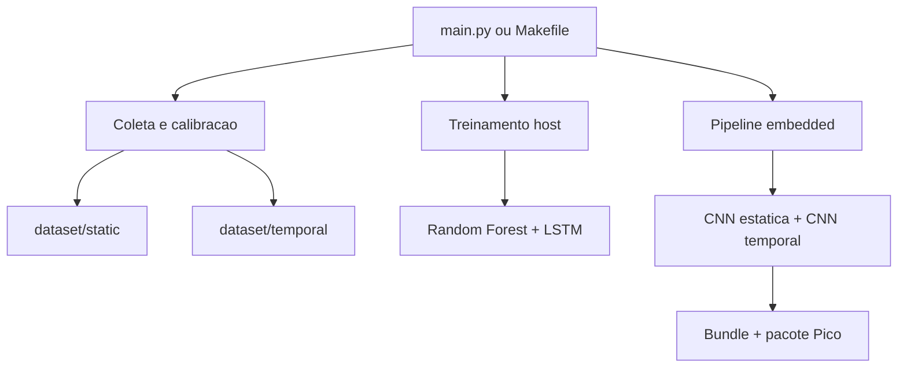
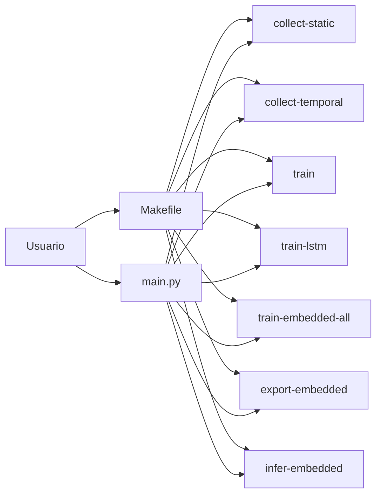
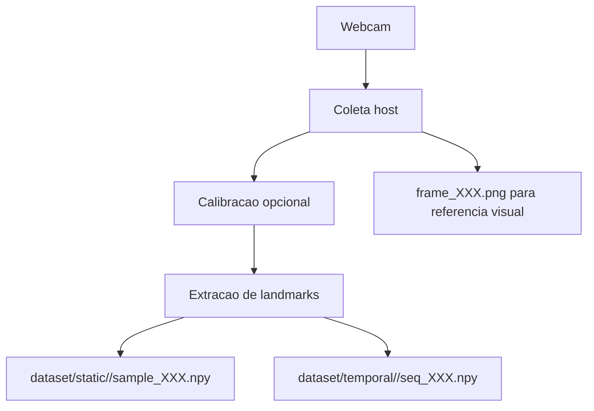
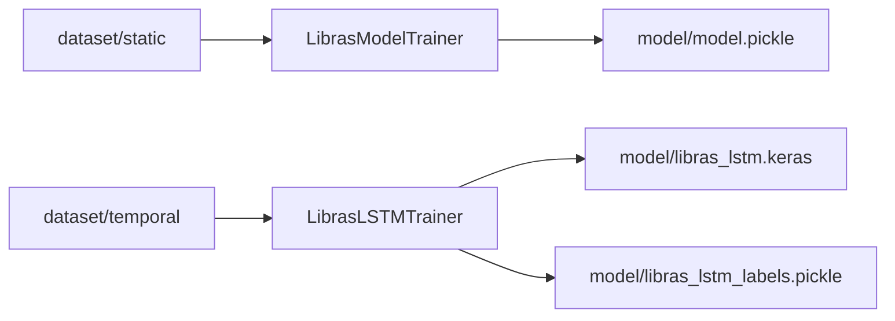
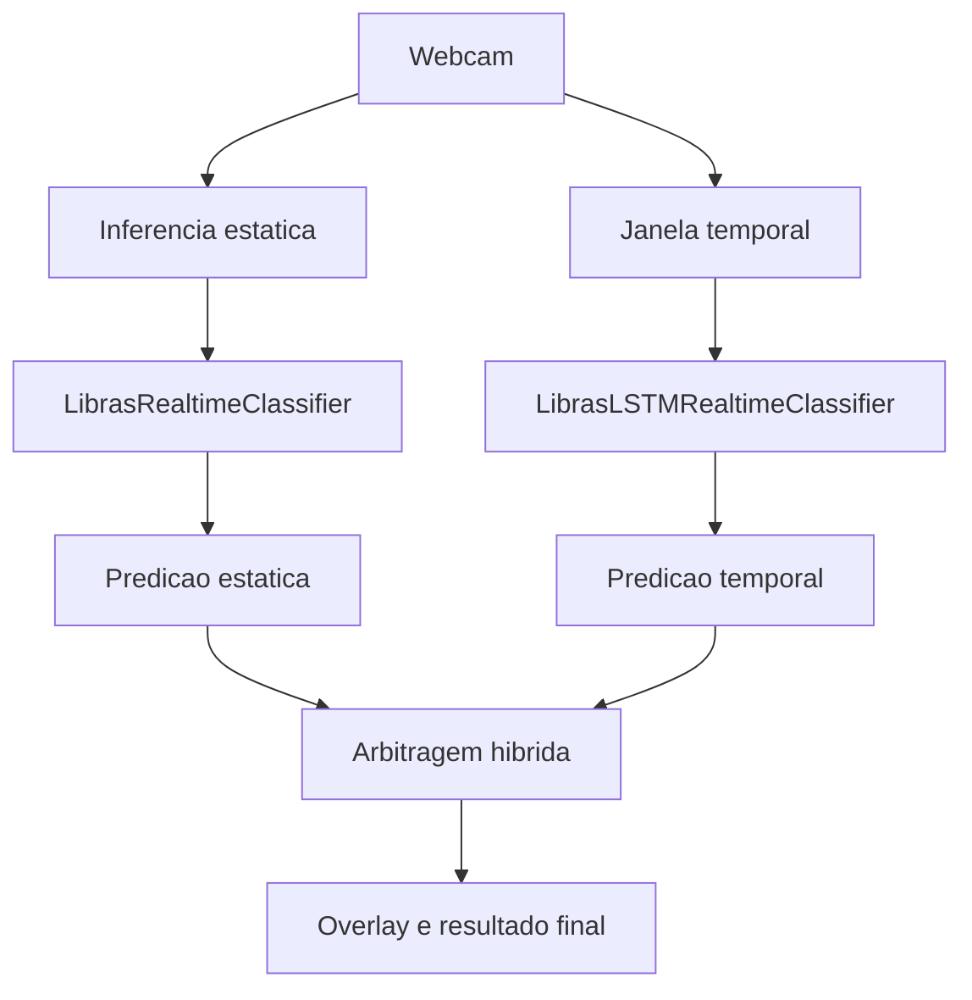
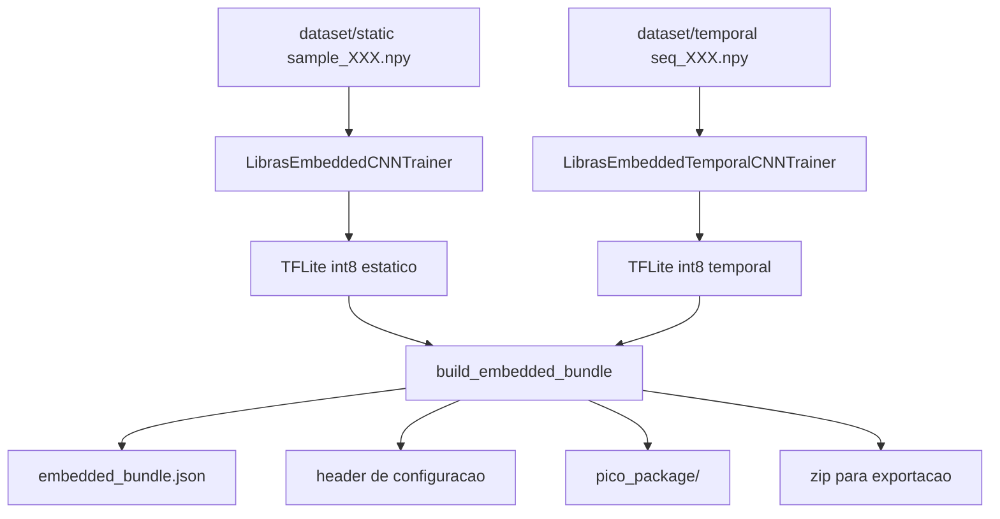
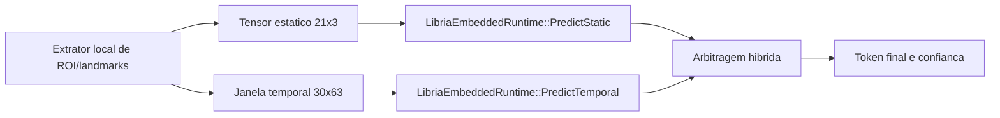
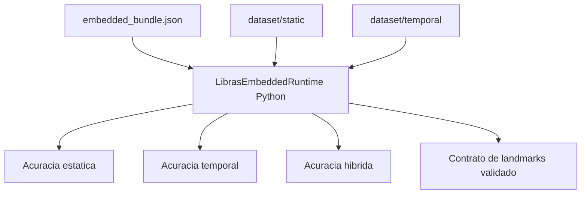

# Arquitetura e Fluxos - LibrIA

Este documento organiza o projeto em diagramas pequenos, cada um cobrindo uma etapa clara do fluxo. A ideia e permitir leitura incremental: quando uma etapa termina, a proxima navegacao fica indicada logo abaixo do diagrama.

## Como navegar

1. Comece pela visao geral.
2. Siga para a etapa do fluxo que voce quer entender.
3. Use os links abaixo de cada diagrama para continuar a leitura sem precisar voltar ao topo.

## 1. Visao geral do projeto

Sequencia desta etapa:
- Proximo: [2. Entradas e Comandos](#2-entradas-e-comandos)
- Se quiser focar em dados: [3. Coleta e Geracao de Dataset](#3-coleta-e-geracao-de-dataset)
- Se quiser focar em embedded: [6. Pipeline Embedded e Export para Pico](#6-pipeline-embedded-e-export-para-pico)

Leitura complementar:
- [../README.md](../README.md)
- [DEVELOPMENT.md](DEVELOPMENT.md)

## 2. Entradas e Comandos

Sequencia desta etapa:
- Voltar: [1. Visao geral do projeto](#1-visao-geral-do-projeto)
- Proximo: [3. Coleta e Geracao de Dataset](#3-coleta-e-geracao-de-dataset)
- Pular para inferencia: [5. Inferencia Host](#5-inferencia-host)

Leitura complementar:
- [../README.md](../README.md)
- [DEVELOPMENT.md](DEVELOPMENT.md)

## 3. Coleta e Geracao de Dataset

Sequencia desta etapa:
- Voltar: [2. Entradas e Comandos](#2-entradas-e-comandos)
- Proximo: [4. Treinamento Host](#4-treinamento-host)
- Se o foco for formatos: [DATASETS.md](DATASETS.md)

Leitura complementar:
- [DATASETS.md](DATASETS.md)
- [DEVELOPMENT.md](DEVELOPMENT.md)

## 4. Treinamento Host

Sequencia desta etapa:
- Voltar: [3. Coleta e Geracao de Dataset](#3-coleta-e-geracao-de-dataset)
- Proximo: [5. Inferencia Host](#5-inferencia-host)
- Se o foco for embedded: [6. Pipeline Embedded e Export para Pico](#6-pipeline-embedded-e-export-para-pico)

Leitura complementar:
- [DEVELOPMENT.md](DEVELOPMENT.md)
- [DATASETS.md](DATASETS.md)

## 5. Inferencia Host

Sequencia desta etapa:
- Voltar: [4. Treinamento Host](#4-treinamento-host)
- Proximo: [6. Pipeline Embedded e Export para Pico](#6-pipeline-embedded-e-export-para-pico)
- Pular para runtime final: [7. Runtime no Dispositivo](#7-runtime-no-dispositivo)

Leitura complementar:
- [../README.md](../README.md)
- [DEVELOPMENT.md](DEVELOPMENT.md)

## 6. Pipeline Embedded e Export para Pico

Sequencia desta etapa:
- Voltar: [5. Inferencia Host](#5-inferencia-host)
- Proximo: [7. Runtime no Dispositivo](#7-runtime-no-dispositivo)
- Validacao no host: [8. Verificacao do Bundle Embedded](#8-verificacao-do-bundle-embedded)

Leitura complementar:
- [DATASETS.md](DATASETS.md)
- [../README.md](../README.md)

## 7. Runtime no Dispositivo

Sequencia desta etapa:
- Voltar: [6. Pipeline Embedded e Export para Pico](#6-pipeline-embedded-e-export-para-pico)
- Proximo: [8. Verificacao do Bundle Embedded](#8-verificacao-do-bundle-embedded)
- Se quiser detalhes dos artefatos: [DATASETS.md](DATASETS.md)

Leitura complementar:
- [../src/interfaces/libria_embedded_runtime.h](../src/interfaces/libria_embedded_runtime.h)
- [../src/interfaces/libria_embedded_runtime.cpp](../src/interfaces/libria_embedded_runtime.cpp)

## 8. Verificacao do Bundle Embedded

Sequencia desta etapa:
- Voltar: [7. Runtime no Dispositivo](#7-runtime-no-dispositivo)
- Reiniciar leitura: [1. Visao geral do projeto](#1-visao-geral-do-projeto)
- Operacao pratica: [../README.md](../README.md)

Leitura complementar:
- [../README.md](../README.md)
- [DEVELOPMENT.md](DEVELOPMENT.md)

## Resumo de navegacao

- Inicio rapido: [1. Visao geral do projeto](#1-visao-geral-do-projeto)
- Fluxo de dados: [3. Coleta e Geracao de Dataset](#3-coleta-e-geracao-de-dataset)
- Fluxo host: [4. Treinamento Host](#4-treinamento-host)
- Fluxo embedded: [6. Pipeline Embedded e Export para Pico](#6-pipeline-embedded-e-export-para-pico)
- Runtime final: [7. Runtime no Dispositivo](#7-runtime-no-dispositivo)

Ultima atualizacao: 2026-03-12